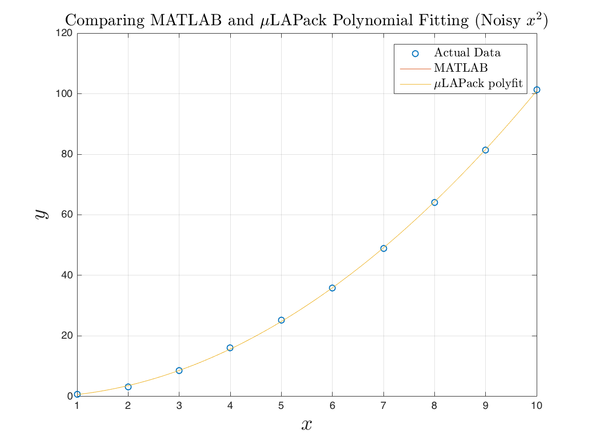

# μLAPack
Micro Linear Algebra Package

Pronounced: mu la pack

A small linear algebra package to compute various matrix/vector operations.
The library is optimized to work on microcontrollers and embedded environments, but can be used anywhere C can be compiled.


[](https://travis-ci.com/SargisYonan/uLAPack) [](https://zenodo.org/badge/latestdoi/164747669)


## Features
All μLAPack functions are "safe" in that the matrix/vector operations are checked for initialization and mathematic dimensional legality before an operation takes place. The library contains various operations and manipulations that can be configured to your needs. The library can be configured to run safely in even the most constrained environments where memory allocation is a concern.

### Included Functionality
μLAPack contains functionality to assist in your matrix math needs for feedback control, statistical analysis, data processing, filtering, estimation, basic algebraic computation, and machine learning.

#### Library Specific Functions
* Initialize a matrix/vector object - `ulapack_initialize`
* Print a matrix/vector to an output file stream - `ulapack_print`
* Free dynamically allocated matrix/vector memory - `ulapack_destroy`
* Safely edit a matrix/vector element - `ulapack_edit_entry`
* Safely modify a matrix/vector element - `ulapack_get_entry`
* Query an object to see if it is a vector - `ulapack_is_vector`
* Copy the contents of a matrix or vector - `ulapack_copy`
* Copy data from an array to a matrix column - `ulapack_array_col_copy`
* Copy data from an array to a matrix row - `ulapack_array_row_copy`

#### Basic Matrix/Vector Operations
* Get the size of a matrix or vector - `ulapack_size`
* Check if two matrices or vectors are equal in value - `ulapack_is_equal`

##### Arithmetic
* Sum the elements of a matrix or vector - `ulapack_sum`
* Add two matrices or vectors - `ulapack_add`
* Subtract two matrices or vectors - `ulapack_subtract`
* Take the trace of a matrix - `ulapack_trace`
* Take the product of two matrices or vectors - `ulapack_product`
* Take the inner product of two vectors - `ulapack_dot`
* Take the norm of a vector or Frobenius norm of a matrix - `ulapack_norm`
* Find the determinant of a Matrix - `ulapack_det`
* Scale a matrix or vector by a scalar - `ulapack_scale`

##### Manipulations
* Put a vector on the diagonal of a matrix - `ulapack_diag`
* Set a square matrix to the identity matrix - `ulapack_eye` 
* Safely set the entirety of matrix/vector to a single value - `ulapack_set`
* Take the transpose of a matrix or vector - `ulapack_transpose`
* Take the inverse of a matrix - `ulapack_inverse`
* Take the pseudo inverse of a matrix - `ulapack_pinverse`

#### Advanced Operations
* Decompose a matrix into LU triangular matrices - `ulapack_lu`
* Create a Vandermonde matrix from a vector - `ulapack_vandermonde`
* Compute the least squares of a matrix/system - `ulapack_least_squares`
* Fit an nth degree polynomial - `ulapack_polyfit`
* Decompose a matrix via Singular Value Decomposition (SVD) - `ulapack_svd`
* Compute a score matrix via Principle Component Analysis (PCA) - `ulapack_pca`

### Options
Compile time options can be set in either the file `ulapack_options.h` or in a build/make system. The user of μLAPack can make the following considerations while using the library.

#### Static Memory Allocation
The user of this library has the option of only using static memory allocation. This option is most suitable in embedded environments that can not dynamically allocate memory because of safety concerns with calls to alloc and because of time critical requirements. The macro `ULAPACK_USE_STATIC_ALLOC` must be `#define`d at compile time in order to use the static memory allocation feature. The static allocation technique relies on using overhead memory in the static matrix memory allocation. Due to this technique, the maximum possible row and column dimensions of any matrix object must be explicitly defined at compile time via the macros: `ULAPACK_MAX_MATRIX_N_ROWS` and `ULAPACK_MAX_MATRIX_N_COLS`. Any matrix initialized after compile time can not exceed the dimensions defined by the macros, and an error will be returned upon initialization if this is attempted.

#### Dynamic Memory Allocation
Define `ULAPACK_USE_DYNAMIC_ALLOC` to specify using dynamic memory allocation for all objects.

#### Choose Your Entry Container Type
The user of this library has the option of setting the matrix/vector element data type to a desired type via the `ULAPACK_MATRIX_ENTRY_TYPE` `#define`. It is recommended that a primitive floating point type is used. `ULAPACK_MATRIX_ENTRY_TYPE` is set to `double` by default, and is `typedef`ed to `MatrixEntry_t` in the source code.
`MINIMUM_THRESHOLD_TOLERANCE` defines the threshold floating point limit for a 0.

#### Clear Upon Initialization
All new matrix/vector objects made can be initialized to zeros if `ULAPACK_INITIALIZE_MEMORY` is defined at compile time.

#### Matrix Inversion Options
Define `ULAPACK_INVERSE_VIA_LU` to use LU decomposition for matrix inversions.

#### Allocator/Freer Options
If dynamic memory allocation is used, the memory allocator and freer can be configured via the macros `ULAPACK_ALLOC` and `ULAPACK_FREE`.

### Unit Tests
μLAPack was developed using test-driven practices. The unit tests and `Makefile` for building and running the unit tests are in the `test/` directory. To test static memory allocation run `make ulapack_test_static`. To unit test the dynamically allocated methods, run `make ulapack_test_dynamic`. To run both tests, use `make`. `valgrind ./ulapack_test_dynamic` returns no memory leaks while using dynamic memory allocation.

### Error Codes
The following error codes can be returned from the library functions. See the in-file documentation for the function to check its return codes of type `MatrixError_t`.

* `ulapack_error` -  general error code
* `ulapack_oom` - out of memory error code
* `ulapack_invalid_argument` - bad argument given to function
* `ulapack_uninit_obj` - uninitialized object passed into function
* `ulapack_success` - general success code

# Usage

## Include The Library
```C
#include "ulapack.h"

```

## Statically Allocated Matrix
An example of setting up and using μLAPack with static memory allocation turned on.

File: `ulapack_options.h`
```C
#define ULAPACK_USE_STATIC_ALLOC // switch on static allocation
#define ULAPACK_MAX_MATRIX_N_ROWS (10u) // set maximum matrix rows possible to 10
#define ULAPACK_MAX_MATRIX_N_COLS (10u) // set maximum matrix cols possible to 10

```
File: `another_c_file.c`
```C
#include "ulapack.h"

...

Matrix_t A; // declare a matrix object with name A
ulapack_initialize_matrix(&A, 3u, 3u); // initialize the matrix with size 3X3
ulapack_eye(&A); // set the matrix A equal to the 3X3 identity matrix
ulapack_scale(&A, 3, &A); // scale the matrix A by 3

ulapack_print(&A, stdout);

```

Output:
``` 
[ 3 0 0 ]
[ 0 3 0 ]
[ 0 0 3 ]
```

## Dynamically Allocated Matrix
An example of setting up and using μLAPack with static memory allocation turned on.

File: `ulapack_options.h`
```C
#define ULAPACK_USE_DYNAMIC_ALLOC // switch on dynamic allocation

```

File: `a_c_file.c`
```C
#include "ulapack.h"

...

Matrix_t *A; // declare a matrix object pointer with name A
ulapack_initialize_matrix(&A, 3u, 3u); // initialize the matrix with size 3X3
ulapack_eye(A); // set the matrix A equal to the 3X3 identity matrix
ulapack_scale(A, 3, A); // scale the matrix A by 3

ulapack_print(A, stdout);

```

Output:
``` 
[ 3 0 0 ]
[ 0 3 0 ]
[ 0 0 3 ]
```
# Examples
Navigate to the `examples/` directory for code samples using μLAPack.

An example of using μLAPack for Principle Component Analysis (PCA).
```C
#include "ulapack.h"

int main(void) {

    double Adata[10][8] = { {0.4170, 0.4192, 0.8007, 0.0983, 0.9889, 0.0194, 0.1023, 0.9034},
                            {0.7203, 0.6852, 0.9683, 0.4211, 0.7482, 0.6788, 0.4141, 0.1375},
                            {0.0001, 0.2045, 0.3134, 0.9579, 0.2804, 0.2116, 0.6944, 0.1393},
                            {0.3023, 0.8781, 0.6923, 0.5332, 0.7893, 0.2655, 0.4142, 0.8074},
                            {0.1468, 0.0274, 0.8764, 0.6919, 0.1032, 0.4916, 0.0500, 0.3977},
                            {0.0923, 0.6705, 0.8946, 0.3155, 0.4479, 0.0534, 0.5359, 0.1654},
                            {0.1863, 0.4173, 0.0850, 0.6865, 0.9086, 0.5741, 0.6638, 0.9275},
                            {0.3456, 0.5587, 0.0391, 0.8346, 0.2936, 0.1467, 0.5149, 0.3478},
                            {0.3968, 0.1404, 0.1698, 0.0183, 0.2878, 0.5893, 0.9446, 0.7508},
                            {0.5388, 0.1981, 0.8781, 0.7501, 0.1300, 0.6998, 0.5866, 0.7260}};

    Matrix_t A;
    Matrix_t T;

    ulapack_init(&A, 10, 8);
    ulapack_init(&T, 10, 10);

    /*
     * Copy data points into vector objects.
     */
    for (uint64_t row_itor = 0; row_itor < 10; row_itor++) {
        for (uint64_t col_itor = 0; col_itor < 8; col_itor++) {
            ulapack_edit_entry(&A, 
            row_itor, col_itor, 
            Adata[row_itor][col_itor]);
        }
    }

    ulapack_pca(&A, &T);
}
```

An example using μLAPack for polynomial regression.

```C
#include "ulapack.h"

int main(void) {
    /*
     * Fit 10 data points.
     */
    uint64_t data_points = 10;

    /*
     * Fit to the 2nd degree.
     */
    uint64_t fit_degree = 2;

    double xdata[] = {1, 2, 3, 4, 5, 6, 7, 8, 9, 10};
    /*
     * x^2 + noise
     */
    double ydata[] = {0.679196, 3.215585, 
                      8.635037, 16.117271, 
                      25.174340, 35.784344, 
                      48.847389, 64.033688, 
                      81.458282, 101.281631};

    /*
     * Declare vector objects for data points.
     */
    Matrix_t x;
    Matrix_t y;

    /*
     * Declare vector object for coefficients.
     */
    Matrix_t p;

    /*
     * Initialize vector objects.
     */
    ulapack_init(&x, data_points, 1);
    ulapack_init(&y, data_points, 1);

    ulapack_init(&p, fit_degree + 1, 1);

    /*
     * Copy data points into vector objects.
     */
    for (uint64_t row_itor = 0; row_itor < data_points; row_itor++) {
        ulapack_edit_entry(&x, 
            row_itor, 0, 
            xdata[row_itor]);

        ulapack_edit_entry(&y, 
            row_itor, 0, 
            ydata[row_itor]);
    }

    /*
     * Run the regression.
     */
    ulapack_polyfit(&x, &y, fit_degree, &p);
}
```



# Requirements
The libc math.h library is required for a square root operation in the `ulapack_norm` function. To avoid the use of additional cmath library calls, the `math.h` `pow()` function was rewritten as a private function.

# Licensing & Support
μLAPack and any derivative works of μLAPack (and embedded_lapack) are free to use for personal and/or educational use without profit and for development purposes in your project(s) to verify if μLAPack is right for you. Contact Sargis Yonan at sargis@yonan.org with the subject line `uLAPack Licensing` to further discuss developer licensing for your project/product, and redistribution. Refer to the [LICENSE](LICENSE) document for licensing details.

# Legacy
μLAPack is a fork of my now deprecated [embedded_lapack](https://www.github.com/SargisYonan/embedded_lapack) library. μLAPack includes definitions for both static and dynamic memory allocation, safer type definitions, more explicit and safer error code status, Doxygen, more functionality, and more compiler support when compared to embedded_lapack.

# TODO
* find occurrences and indices of a value in a matrix/vector - `ulapack_find`
* take the pseudo inverse of a matrix via SVD (good for poorly conditioned matrix inversions)
* grab a sub-matrix from a matrix/vector (similar to the `:` operator in MATLAB) - `ulapack_copy_submatrix`
* take the cross product of two vector - `ulapack_cross`
* write an element square root function to replace libc call
* make a skew symmetric matrix - `ulapack_skew`
* make a Kalman extension package `μKalman` with:
    - model propagation
    - Kalman gain matrix calculations using μLAPack

Have a suggestion for a new feature/function? File an issue in this repository with your requests.
